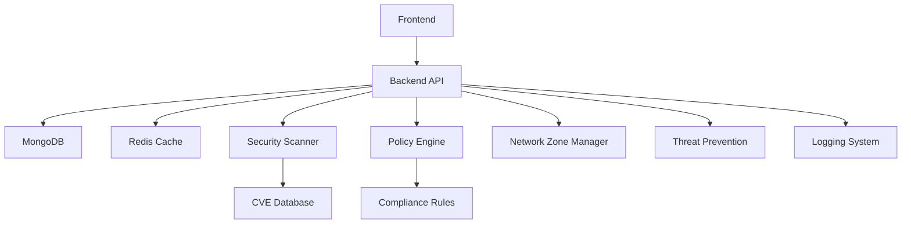

# Security Configuration Platform Documentation

<div class="feature-grid">
  <div class="feature-card">
    <h3>🚀 Quick Start</h3>
    <p>Get up and running in minutes with our comprehensive setup guide</p>
    <a href="#/getting-started" class="button">Get Started</a>
  </div>
  <div class="feature-card">
    <h3>🏗️ Architecture</h3>
    <p>Understand the system design and component interactions</p>
    <a href="#/architecture" class="button">View Architecture</a>
  </div>
  <div class="feature-card">
    <h3>⚙️ Configuration</h3>
    <p>Learn how to configure and customize the platform</p>
    <a href="#/configuration" class="button">Configure</a>
  </div>
  <div class="feature-card">
    <h3>🔧 Development</h3>
    <p>Set up your development environment and start coding</p>
    <a href="#/development" class="button">Develop</a>
  </div>
</div>

## Overview

The Security Configuration Platform is a comprehensive solution for managing and automating security configurations across your infrastructure. Built with modern technologies and best practices, it provides a robust foundation for security management.

### Key Features

- 🔒 **Security Configuration Management**
  - Centralized security policy management
  - Network zone configuration
  - Threat prevention settings
  - Logging configuration
  - Compliance monitoring

- 🚀 **Easy Integration**
  - RESTful API
  - WebSocket support
  - Docker containerization
  - MongoDB data persistence
  - Redis caching

- 📊 **Advanced Analytics**
  - Security posture assessment
  - Compliance reporting
  - Trend analysis
  - Real-time monitoring
  - Audit logging

- 🔄 **Automation**
  - Automated policy enforcement
  - Scheduled scans
  - Custom workflows
  - CVE data integration
  - Configuration validation

## Quick Start

1. **Clone the Repository**

   ```bash
   git clone https://github.com/robbedell/security-config-platform.git
   cd security-config-platform
   ```

2. **Start Development Environment**

   ```bash
   # Start all services
   docker compose up -d

   # Check service status
   docker compose ps
   ```

3. **Access the Platform**
   - Frontend: http://localhost:3000
   - Backend API: http://localhost:3001
   - Documentation: http://localhost:3000/docs

## System Architecture



## Getting Help

- 📚 [Documentation](https://robbedell.github.io/security-config-platform)
- 💬 [GitHub Discussions](https://github.com/robbedell/security-config-platform/discussions)
- 🐛 [Issue Tracker](https://github.com/robbedell/security-config-platform/issues)
- 📧 [Email Support](mailto:support@security-config-platform.com)

## Contributing

We welcome contributions! Please see our [Contributing Guide](CONTRIBUTING.md) for details.

## License

This project is licensed under the MIT License - see the [LICENSE](LICENSE) file for details.

---

<div class="card">
  <h3>🚀 Ready to Get Started?</h3>
  <p>Follow our comprehensive guide to set up and start using the Security Configuration Platform.</p>
  <a href="#/getting-started" class="button">Begin Setup</a>
</div>
