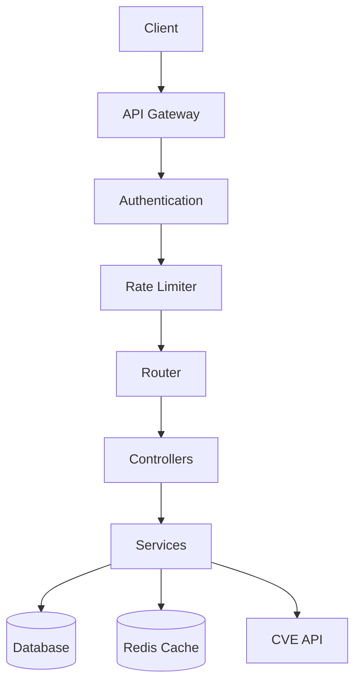
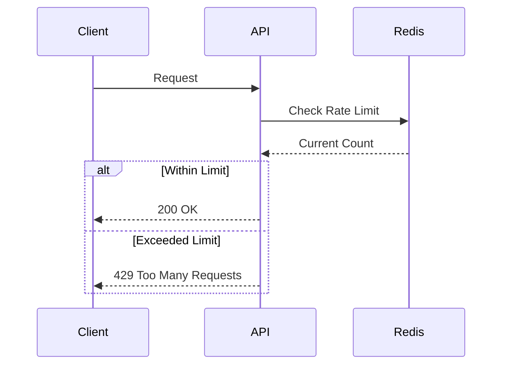
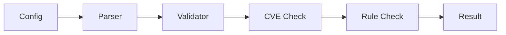
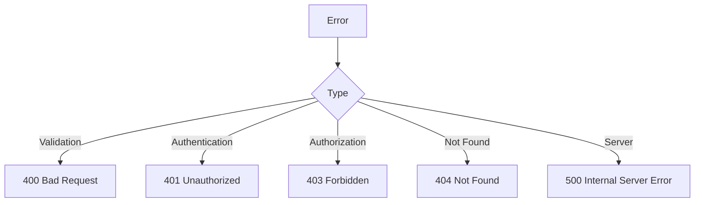
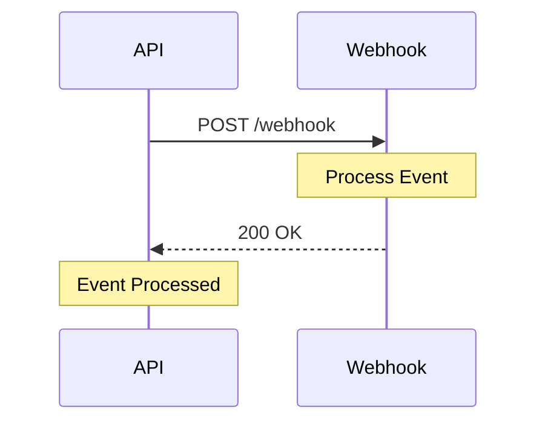

# API Endpoints

## Overview

The Security Configuration Platform API provides a comprehensive set of endpoints for managing security configurations and CVE data.



## Authentication

All API endpoints require authentication using JWT tokens. Include the token in the Authorization header:

```http
Authorization: Bearer <your-jwt-token>
```

## Rate Limiting

API requests are limited to 100 requests per minute per IP address.



## Endpoints

### Get CVE List

Retrieves a list of CVEs with optional filtering.

```api-playground
/api/v1/cves
GET
{
  "severity": "HIGH",
  "vendor": "cisco",
  "limit": 10,
  "offset": 0
}
```

### Create Configuration

Creates a new security configuration.

```api-playground
/api/v1/configurations
POST
{
  "name": "Cisco IOS Security Config",
  "vendor": "cisco",
  "rules": [
    {
      "type": "access_control",
      "action": "deny",
      "source": "any",
      "destination": "any",
      "protocol": "tcp",
      "port": 23
    }
  ],
  "metadata": {
    "description": "Basic security configuration for Cisco IOS",
    "version": "1.0.0"
  }
}
```

### Validate Configuration

Validates a security configuration against CVE data.



```api-playground
/api/v1/configurations/validate
POST
{
  "configuration": {
    "vendor": "cisco",
    "rules": [
      {
        "type": "access_control",
        "action": "deny",
        "source": "any",
        "destination": "any",
        "protocol": "tcp",
        "port": 23
      }
    ]
  },
  "options": {
    "check_cves": true,
    "check_rules": true,
    "check_compliance": true
  }
}
```

## Error Responses

The API uses standard HTTP status codes and provides detailed error messages.



Example error response:

```json
{
  "error": {
    "code": "VALIDATION_ERROR",
    "message": "Invalid configuration format",
    "details": [
      {
        "field": "rules",
        "message": "At least one rule is required"
      }
    ]
  }
}
```

## Webhooks

The API supports webhooks for configuration updates and CVE alerts.



## Best Practices

1. Always include proper error handling
2. Use appropriate HTTP methods
3. Follow RESTful conventions
4. Implement rate limiting
5. Use proper authentication
6. Validate input data
7. Cache responses when appropriate
8. Monitor API usage
