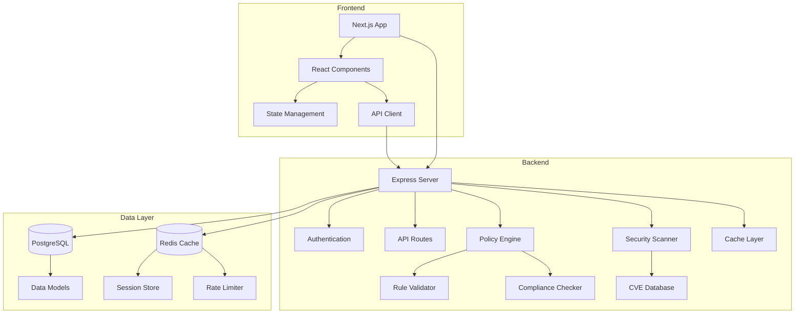
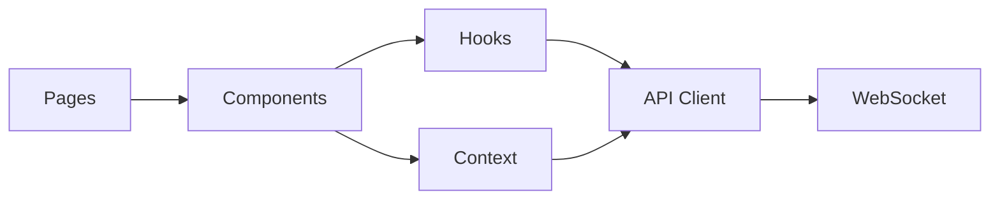
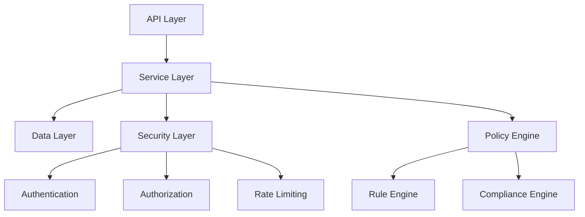
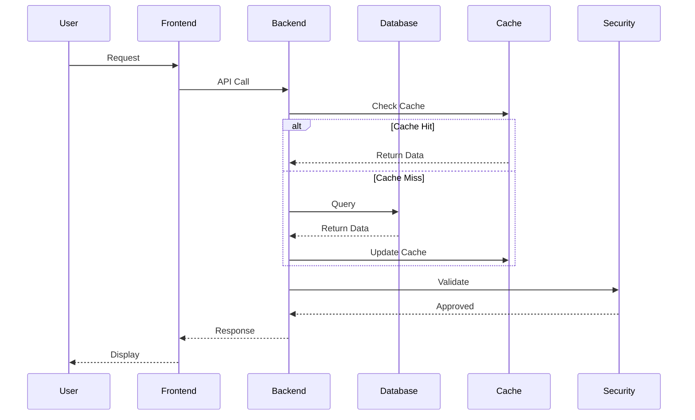
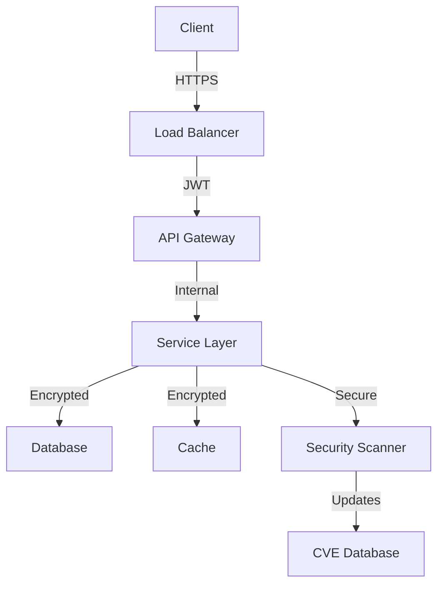
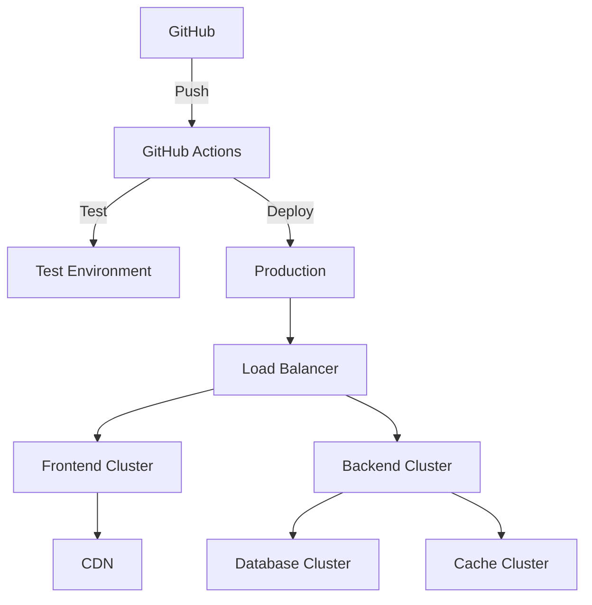
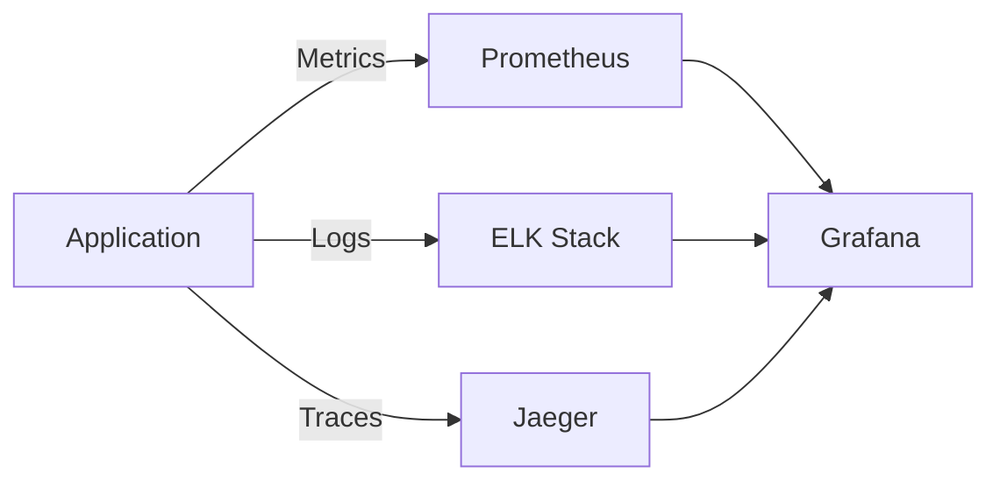

# Architecture Overview

The Security Configuration Platform is built with a modern, scalable architecture that follows best practices for security and performance.

## System Architecture

## Component Overview

### Frontend Architecture

The frontend is built with Next.js and follows a component-based architecture:

- **Pages**: Server-side rendered routes
- **Components**: Reusable UI components
- **Hooks**: Custom React hooks for business logic
- **Context**: Global state management
- **API Client**: TypeScript-based API client
- **WebSocket**: Real-time updates

### Backend Architecture

The backend is built with Node.js and Express:

- **API Layer**: RESTful endpoints and WebSocket handlers
- **Service Layer**: Business logic and orchestration
- **Data Layer**: Database interactions and caching
- **Security Layer**: Authentication, authorization, and rate limiting
- **Policy Engine**: Security policy management and validation

### Data Flow

## Security Architecture

### Security Features

1. **Authentication**

   - JWT-based authentication
   - OAuth2 support
   - 2FA capability

2. **Authorization**

   - Role-based access control
   - Resource-based permissions
   - API key management

3. **Data Protection**

   - Encryption at rest
   - Encryption in transit
   - Secure key management

4. **Monitoring**
   - Audit logging
   - Security alerts
   - Performance metrics

## Deployment Architecture

### Deployment Components

1. **CI/CD Pipeline**

   - Automated testing
   - Security scanning
   - Deployment automation

2. **Infrastructure**

   - Container orchestration
   - Load balancing
   - Auto-scaling

3. **Monitoring**
   - Health checks
   - Performance monitoring
   - Error tracking

## Scalability

The platform is designed to scale horizontally:

1. **Frontend Scaling**

   - CDN distribution
   - Static asset caching
   - Client-side caching

2. **Backend Scaling**

   - Load balancing
   - Service replication
   - Database sharding

3. **Data Layer Scaling**
   - Read replicas
   - Cache distribution
   - Connection pooling

## Performance Optimization

1. **Caching Strategy**

   - Redis caching
   - Browser caching
   - CDN caching

2. **Database Optimization**

   - Index optimization
   - Query optimization
   - Connection pooling

3. **Frontend Optimization**
   - Code splitting
   - Lazy loading
   - Asset optimization

## Monitoring and Observability

### Monitoring Components

1. **Metrics**

   - Application metrics
   - System metrics
   - Business metrics

2. **Logging**

   - Structured logging
   - Log aggregation
   - Log analysis

3. **Tracing**
   - Distributed tracing
   - Performance profiling
   - Error tracking

---

  <h3>🔍 Want to Learn More?</h3>
  
Explore our detailed component documentation and API reference.

  <a href="#/api" class="button">View API Reference</a>

