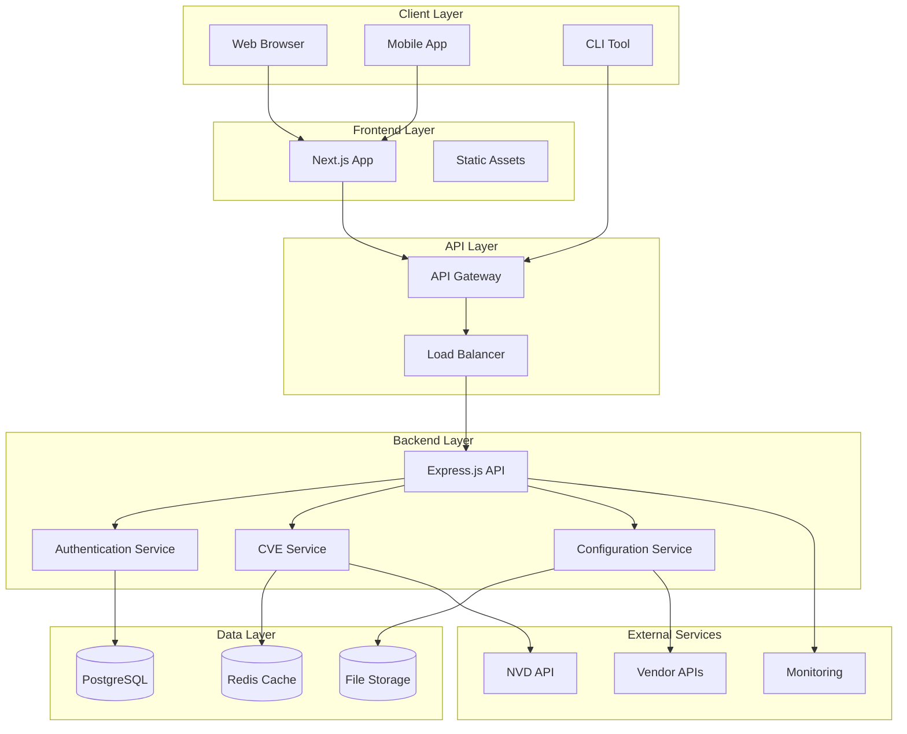
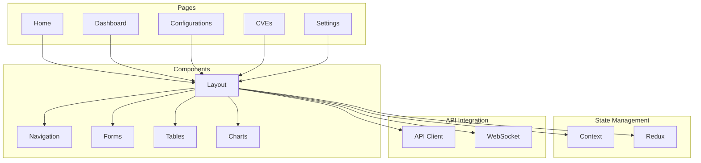
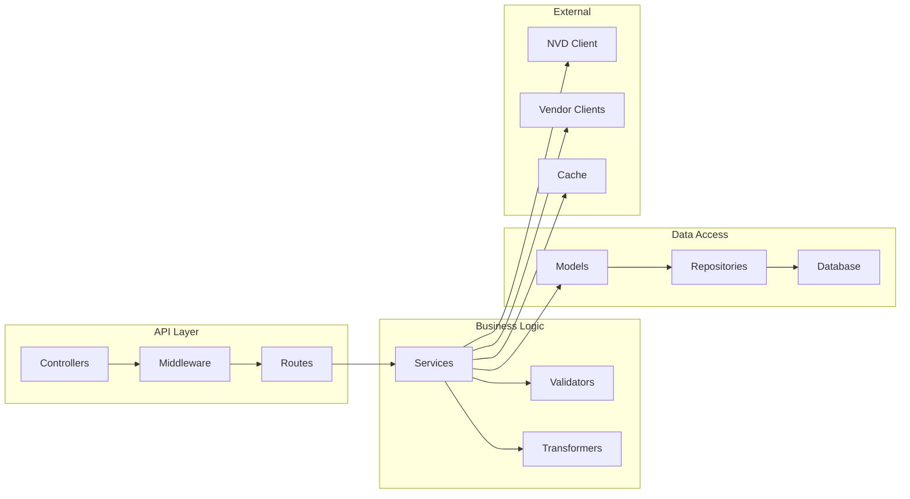
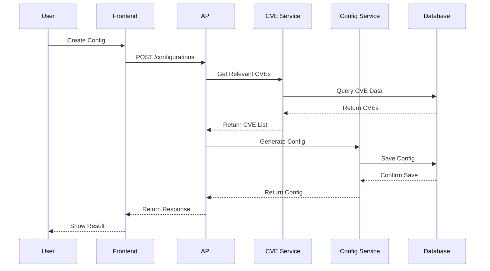
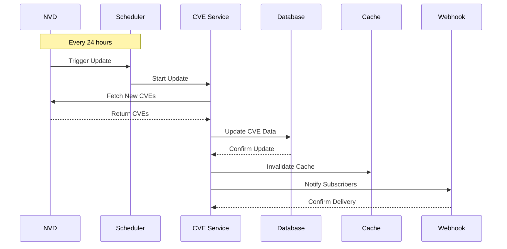
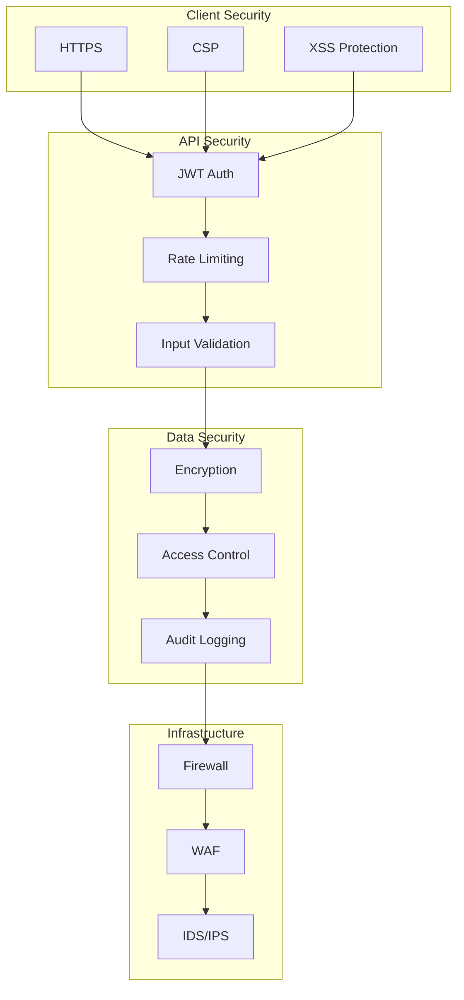
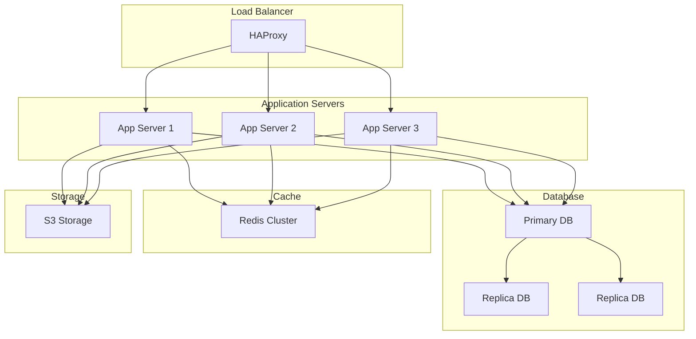

# System Architecture Overview

## High-Level Architecture

The Security Configuration Platform is built with a modern, scalable architecture that separates concerns and enables easy maintenance and scaling.

## Component Details

### Frontend Architecture

The frontend is built with Next.js and follows a component-based architecture.

### Backend Architecture

The backend follows a microservices-inspired architecture with clear separation of concerns.

## Data Flow

### Configuration Generation Flow

### CVE Update Flow

## Security Architecture

The platform implements multiple layers of security measures.

## Deployment Architecture

The platform is designed for high availability and scalability.

